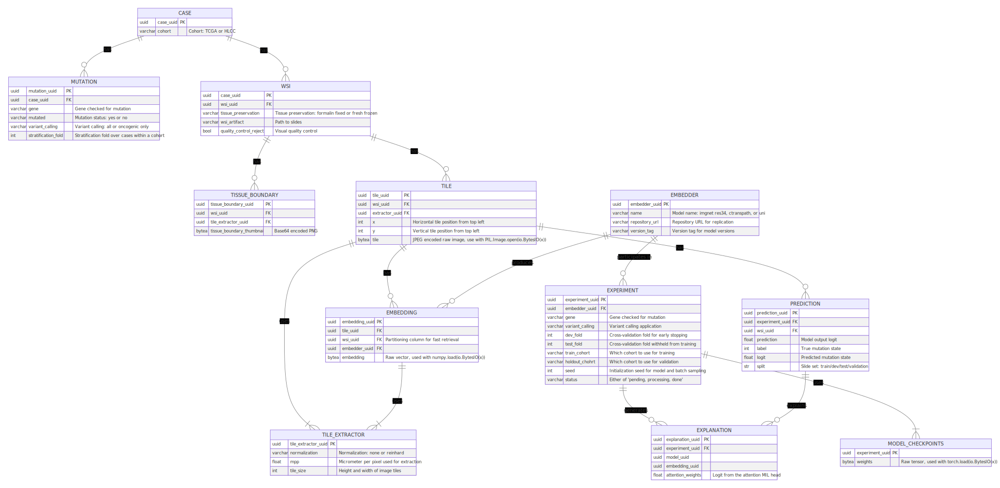

Repostory for replicating mutation prediction in publication 

**Dissecting AI-based mutation prediction in lung adenocarcinoma: a comprehensive real-world study**

> Molecular profiling of lung cancer is critical for identifying genetic alterations that predict response to targeted therapy. Deep learning has shown promise for predicting oncogenic mutations from tissue whole slide images, but existing studies often suffer from limited sample sizes, a focus on earlier stage patients with limited therapeutic applications, and insufficient analysis of robustness and generalizability.
This retrospective study systematically evaluates factors influencing the accuracy of mutation prediction using an  extensive dataset – the Heidelberg Lung Adenocarcinoma Cohort (HLCC) – comprising 2356 late-stage FFPE samples, and is validated on the publicly available TCGA-LUAD cohort.
Our results show that models trained on the sixfold larger HLCC cohort generalize well to the TCGA dataset for mutations in EGFR (AUC 0.76), STK11 (AUC 0.71) and TP53 (AUC 0.75). This supports the hypothesis that cohort sizes improve model robustness. Our benchmark highlights performance variations due to preprocessing and modeling choices, such as mutation variant calling, which can cause changes of up to 7% in EGFR prediction accuracy. 
Model explanations reveal that acinar and papillary growth patterns are key in  detecting EGFR mutations, while solid growth patterns and large nuclei are indicative of TP53 mutations. Despite the advancements, mutation prediction cannot replace comprehensive molecular profiling but can serve as a valuable enrichment tool for clinical trials and enhance  understanding of genotype-phenotype correlations.

Example heatmaps for predicting mutations in EGFR. Acinar and papillary growth patterns are targeted

Example heatmaps for predicting mutations in TP53. High attention patches often contain solid growth pattern.

The repository requires a table of cases with known mutational state and location of their whole slide images and derives the following structure set of tables, including image tiling, image embedding, experiments, the training artifacts, model predictions and their explanations (attention scores). 
The following entity relationship diagram outlines how the data is related and stored.
Due to the size of thousands of models, each attending to millions of patches, a cloud storage should be considered for storing and retrieving the data.

The order of execution is as follows
* `prepare/register_wsis.py` helps in setting up the required table summarizing mutational state and where to find the whole slide images
* `slicing/app/main.py` is iterating over the slide and parameterized to a 224sqpix at 0.5 mpp by default. Execution can be significantly be speed up by using parallel instance. Multiple instances can be launched by setting parallelism in the kubernets deployment `machine.yaml`
* `embedding` packages contains ctranspath and uni embedder, where one retrieval and upload node is launched and multiple embedding services build one backbone.
* `training/gen_experiment.py` lays out which experiments to run and creates the declarative experiments table that can be executed by launching multiple `run.py` workers using the `16core.yaml`, again parallelism significnatly speeds up runtime. 
* `evaluation` contains the code for heatmapping, generation of the tile clusters.